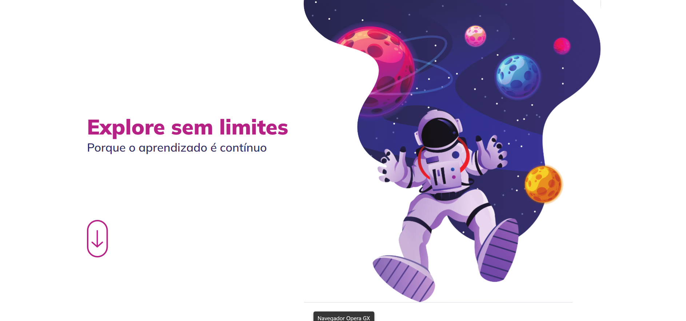

<h1 align="center"> Desafio - Explore sem limites </h1>

Programa exclusivo do Bruno Bianchi, para ensino de tecnologias WEB.  
Desafio proposto pela Rocketseat, A ideia aqui é você recriar esse layout mas, diferente dos desafios iniciais que possuem apenas uma tela. 

  <a href="#-tecnologias">Tecnologias</a>&nbsp;&nbsp;&nbsp;|&nbsp;&nbsp;&nbsp;
  <a href="#-layout">Layout</a>&nbsp;&nbsp;&nbsp;|&nbsp;&nbsp;&nbsp;
  <a href="#-projeto">Projeto</a>

  

  

 

## 🚀 Tecnologias

Esse projeto foi desenvolvido com as seguintes tecnologias:

- HTML e CSS
- Git e Github

## Layout

Link do layout usado no projeto:

- [Layout Figma](https://www.figma.com/file/563kgHMxsEy17nCdTJI6JC/Explore-sem-limites/duplicate?type=design&node-id=158-677&mode=design)

## 💻 Projeto

O Desafio é utlizar o recurso de responsividade!

- [Acesse o projeto finalizado, online](https://brunobianchi13.github.io/Desafio-Explore-sem-limites/)

---

Feito by Bruno Bianchi

